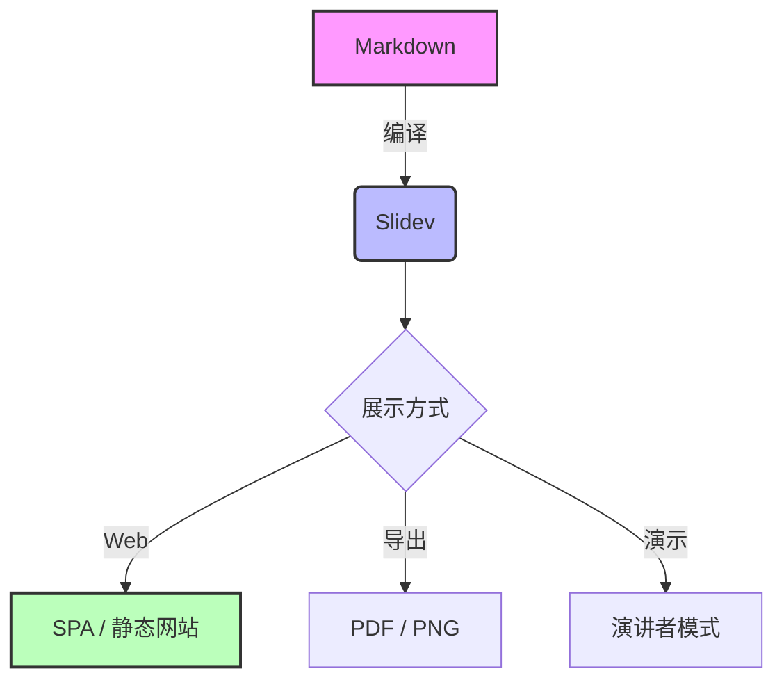

# Slidev

<div v-motion
  :initial="{ x: -80, opacity: 0 }"
  :enter="{ x: 0, opacity: 1, transition: { duration: 1000, type: 'spring' } }">
  为开发者打造的演示文稿工具
</div>

<div class="pt-12" v-motion
  :initial="{ y: 50, opacity: 0 }"
  :enter="{ y: 0, opacity: 1, transition: { delay: 500, duration: 800 } }">
  <span @click="$slidev.nav.next" class="px-2 py-1 rounded cursor-pointer" hover="bg-white/10">
    开启探索之旅 <carbon:arrow-right class="inline animate-bounce"/>
  </span>
</div>

<div class="abs-br m-6 flex gap-2">
  <a href="https://github.com/slidevjs/slidev" target="_blank" alt="GitHub"
    class="text-xl slidev-icon-btn opacity-50 !border-none !hover:text-white">
    <carbon:logo-github />
  </a>
</div>

---
transition: circle-crop
layout: image-right
image: https://cover.sli.dev
---

# 什么是 Slidev?

Slidev 是基于 Web 技术的幻灯片制作工具，专为开发者设计。

它结合了 Markdown 的简洁与 Vue 的强大交互能力。

<v-clicks>

- 📝 **Markdown 优先** - 专注于内容创作
- 🎨 **主题化** - 基于 npm 的主题系统
- 🧑‍💻 **开发者友好** - 代码高亮、实时预览
- 🤹 **交互性** - 嵌入 Vue 组件
- 🎥 **录制** - 内置录制和演讲者视图
- 📤 **导出** - PDF, PNG, SPA 多种格式

</v-clicks>

---
layout: default
---

# 为什么选择 Slidev?

<div class="grid grid-cols-2 gap-10 mt-10">

<div class="bg-red-50 dark:bg-red-900/10 p-6 rounded-xl border border-red-100 dark:border-red-800"
     v-motion
     :initial="{ x: -50, opacity: 0 }"
     :enter="{ x: 0, opacity: 1, transition: { delay: 100 } }">
  <h3 class="text-xl font-bold text-red-600 dark:text-red-400 mb-4 flex items-center gap-2">
    <carbon:close-outline /> 传统 PPT
  </h3>
  <ul class="space-y-3 opacity-80">
    <li class="flex items-center gap-2"><carbon:close class="text-red-500"/> 难以版本控制 (Binary)</li>
    <li class="flex items-center gap-2"><carbon:close class="text-red-500"/> 样式调整繁琐 (Mouse heavy)</li>
    <li class="flex items-center gap-2"><carbon:close class="text-red-500"/> 代码高亮需要截图</li>
    <li class="flex items-center gap-2"><carbon:close class="text-red-500"/> 缺乏交互性</li>
  </ul>
</div>

<div class="bg-green-50 dark:bg-green-900/10 p-6 rounded-xl border border-green-100 dark:border-green-800"
     v-motion
     :initial="{ x: 50, opacity: 0 }"
     :enter="{ x: 0, opacity: 1, transition: { delay: 300 } }">
  <h3 class="text-xl font-bold text-green-600 dark:text-green-400 mb-4 flex items-center gap-2">
    <carbon:checkmark-outline /> Slidev (Markdown)
  </h3>
  <ul class="space-y-3 opacity-80">
    <li class="flex items-center gap-2"><carbon:checkmark class="text-green-500"/> 纯文本，Git 友好</li>
    <li class="flex items-center gap-2"><carbon:checkmark class="text-green-500"/> 专注内容，样式分离</li>
    <li class="flex items-center gap-2"><carbon:checkmark class="text-green-500"/> 真正的代码高亮与运行</li>
    <li class="flex items-center gap-2"><carbon:checkmark class="text-green-500"/> Vue 组件无限可能</li>
  </ul>
</div>

</div>

---
layout: center
class: text-center
---

# 核心特性概览

Slidev 不仅仅是一个 PPT 工具，它是一个完整的 Web 应用。

<div class="grid grid-cols-3 gap-6 mt-8 text-left">
  <div class="bg-blue-500/10 p-6 rounded-lg transform hover:scale-105 transition duration-300 h-full flex flex-col"
       v-motion
       :initial="{ opacity: 0, y: 100 }"
       :enter="{ opacity: 1, y: 0, transition: { delay: 100 } }">
    <div class="text-xl mb-4 flex items-center gap-2 font-bold"><carbon:code class="text-blue-500 animate-pulse"/> 开发者优先</div>
    <div class="opacity-80 text-sm leading-relaxed">Markdown 语法、Vite 驱动、热重载、Vue 组件支持，让开发体验无比顺滑。</div>
  </div>
  <div class="bg-green-500/10 p-6 rounded-lg transform hover:scale-105 transition duration-300 h-full flex flex-col"
       v-motion
       :initial="{ opacity: 0, y: 100 }"
       :enter="{ opacity: 1, y: 0, transition: { delay: 300 } }">
    <div class="text-xl mb-4 flex items-center gap-2 font-bold"><carbon:color-palette class="text-green-500 animate-spin"/> 极致样式</div>
    <div class="opacity-80 text-sm leading-relaxed">UnoCSS 原子化 CSS、可定制主题、Iconify 图标集，轻松打造专业级视觉效果。</div>
  </div>
  <div class="bg-purple-500/10 p-6 rounded-lg transform hover:scale-105 transition duration-300 h-full flex flex-col"
       v-motion
       :initial="{ opacity: 0, y: 100 }"
       :enter="{ opacity: 1, y: 0, transition: { delay: 500 } }">
    <div class="text-xl mb-4 flex items-center gap-2 font-bold"><carbon:presentation-file class="text-purple-500 animate-bounce"/> 演示利器</div>
    <div class="opacity-80 text-sm leading-relaxed">演讲者模式、内置录制、绘图工具、倒计时，助你自信掌控全场。</div>
  </div>
</div>

---
transition: slide-up
---

# 项目结构与生态

Slidev 采用标准的 Vue 项目结构，目录清晰，易于维护。

<div class="grid grid-cols-2 gap-8 items-center mt-4">

<div class="text-sm bg-gray-50 dark:bg-gray-800 p-4 rounded-lg font-mono leading-relaxed border border-gray-200 dark:border-gray-700 shadow-sm"
     v-motion
     :initial="{ opacity: 0, x: -50 }"
     :enter="{ opacity: 1, x: 0, transition: { delay: 100 } }">

```text
my-slidev/
  ├── components/       # 🧩 自定义 Vue 组件
  ├── layouts/          # 📐 自定义布局
  ├── public/           # 📂 静态资源 (图片等)
  ├── slides.md         # 📄 主幻灯片入口
  ├── styles/           # 🎨 自定义 CSS/样式
  ├── snippets/         # 📑 代码片段 (外部导入)
  ├── vite.config.ts    # ⚡️ Vite 配置 (可选)
  └── package.json      # 📦 依赖管理
```

</div>

<div class="space-y-4"
     v-motion
     :initial="{ opacity: 0, x: 50 }"
     :enter="{ opacity: 1, x: 0, transition: { delay: 300 } }">

<div class="flex items-start gap-4 p-2 rounded-lg hover:bg-gray-50 dark:hover:bg-gray-800/50 transition">
  <div class="bg-blue-500 text-white p-2 rounded-full mt-1 shadow-md shadow-blue-500/30 flex-shrink-0 w-12 h-12 flex items-center justify-center"><carbon:settings class="text-lg"/></div>
  <div>
    <h3 class="font-bold text-lg mb-1">约定优于配置</h3>
    <p class="text-sm opacity-75 leading-relaxed">自动加载组件、布局和样式，无需繁琐的手动引入配置。</p>
  </div>
</div>

<div class="flex items-start gap-4 p-2 rounded-lg hover:bg-gray-50 dark:hover:bg-gray-800/50 transition">
  <div class="bg-yellow-500 text-white p-2 rounded-full mt-1 shadow-md shadow-yellow-500/30 flex-shrink-0 w-12 h-12 flex items-center justify-center"><logos:vitejs class="text-lg"/></div>
  <div>
    <h3 class="font-bold text-lg mb-1">Vite 驱动</h3>
    <p class="text-sm opacity-75 leading-relaxed">秒级启动，热更新飞快。享受庞大的 Vite 插件生态。</p>
  </div>
</div>

<div class="flex items-start gap-4 p-3 rounded-lg hover:bg-gray-50 dark:hover:bg-gray-800/50 transition">
  <div class="bg-green-500 text-white p-2 rounded-full mt-1 shadow-md shadow-green-500/30 flex-shrink-0 w-12 h-12 flex items-center justify-center"><logos:vue class="text-lg"/></div>
  <div>
    <h3 class="font-bold text-lg mb-1">Vue 生态</h3>
    <p class="text-sm opacity-75 leading-relaxed">直接使用 VueUse、Pinia 等库，复用现有的 Vue 开发经验。</p>
  </div>
</div>

</div>

</div>

---
layout: default
---

# 💻 编辑器集成 (VS Code)

Slidev 与 VS Code 深度集成，提供极致的开发体验。

<div class="grid grid-cols-2 gap-8 mt-8">

<div class="space-y-4">
  <div class="flex items-center gap-3">
    <vscode-icons:file-type-vscode class="text-4xl" />
    <span class="text-xl font-bold">Slidev Extension</span>
  </div>
  <p class="opacity-80">
    在 VS Code 中直接预览幻灯片，点击幻灯片元素即可跳转到对应的 Markdown 源码位置。
  </p>
  <ul class="list-disc list-inside opacity-70 space-y-2">
    <li>实时预览 (Side-by-side)</li>
    <li>自动补全 (Components, Icons)</li>
    <li>一键跳转 (Click to edit)</li>
    <li>支持多窗口联动</li>
  </ul>
</div>

<div class="bg-gray-900 rounded-lg p-4 border border-gray-700 shadow-xl"
     v-motion
     :initial="{ opacity: 0, scale: 0.9 }"
     :enter="{ opacity: 1, scale: 1, transition: { delay: 200 } }">
  <div class="flex items-center gap-2 mb-2 border-b border-gray-700 pb-2">
    <div class="w-3 h-3 rounded-full bg-red-500"></div>
    <div class="w-3 h-3 rounded-full bg-yellow-500"></div>
    <div class="w-3 h-3 rounded-full bg-green-500"></div>
    <span class="text-xs text-gray-400 ml-2">VS Code</span>
  </div>
  <div class="font-mono text-sm text-gray-300 leading-relaxed">
    <span class="text-gray-500">10</span> <span class="text-blue-400">#</span> My Slide<br>
    <span class="text-gray-500">11</span> <br>
    <span class="text-gray-500">12</span> <span class="text-purple-400">&lt;div</span> <span class="text-yellow-400">@click</span>=<span class="text-green-400">"next"</span><span class="text-purple-400">&gt;</span><br>
    <span class="text-gray-500">13</span> &nbsp;&nbsp;Click me!<br>
    <span class="text-gray-500">14</span> <span class="text-purple-400">&lt;/div&gt;</span>
  </div>
</div>

</div>

---
layout: center
---

# 🌍 全局图层 (Global Layers)

想在所有幻灯片上显示 Logo、页脚或背景动画？使用全局图层。

<div class="grid grid-cols-2 gap-10 mt-8 text-left">

<div class="bg-gray-50 dark:bg-gray-800 p-6 rounded-xl border border-gray-200 dark:border-gray-700">
  <h3 class="font-bold text-lg mb-2 text-green-600 dark:text-green-400">global-top.vue</h3>
  <p class="opacity-75 mb-4 text-sm">覆盖在所有幻灯片之上的图层。适合放置 Logo、水印、全局导航。</p>
  <code class="block bg-gray-200 dark:bg-gray-900 p-3 rounded text-xs mb-4 font-mono">
    &lt;!-- global-top.vue --&gt;<br>
    &lt;template&gt;<br>
    &nbsp;&nbsp;&lt;footer class="absolute bottom-0 right-0 p-2"&gt;<br>
    &nbsp;&nbsp;&nbsp;&nbsp;My Presentation<br>
    &nbsp;&nbsp;&lt;/footer&gt;<br>
    &lt;/template&gt;
  </code>
</div>

<div class="bg-gray-50 dark:bg-gray-800 p-6 rounded-xl border border-gray-200 dark:border-gray-700">
  <h3 class="font-bold text-lg mb-2 text-blue-600 dark:text-blue-400">global-bottom.vue</h3>
  <p class="opacity-75 mb-4 text-sm">位于所有幻灯片之下的图层。适合放置动态背景、全局纹理。</p>
  <code class="block bg-gray-200 dark:bg-gray-900 p-3 rounded text-xs font-mono">
    &lt;!-- global-bottom.vue --&gt;<br>
    &lt;template&gt;<br>
    &nbsp;&nbsp;&lt;div class="bg-image full-screen" /&gt;<br>
    &lt;/template&gt;
  </code>
</div>

</div>

---
transition: view-transition
---

# 1. 强大的 Markdown 扩展

Slidev 在标准 Markdown 基础上增加了许多实用的扩展。

<div class="grid grid-cols-2 gap-8">

<div v-motion-slide-visible-once-left>

### 布局与 Frontmatter

每一页幻灯片都可以通过 Frontmatter 配置。

```yaml
---
layout: image-right
image: https://source.unsplash.com/random
class: text-white
---
```

</div>

<div v-motion-slide-visible-once-right>

### 图标支持 (Iconify)

直接使用 `<icon-set:icon-name />` 语法。

<div class="flex gap-4 text-3xl mt-4">
  <carbon:logo-github class="hover:text-gray-500 transition"/>
  <logos:vue class="hover:scale-125 transition"/>
  <twemoji:sparkles class="animate-pulse"/>
  <ri:presentation-fill class="text-blue-500 animate-bounce"/>
</div>

- <carbon:logo-github /> GitHub
- <logos:vue /> Vue
- <twemoji:sparkles /> Sparkles
- <ri:presentation-fill /> Presentation

</div>

</div>

---
transition: slide-up
---

# 1.1 动画与片段 (Fragments)

按步骤显示内容，控制节奏。

<div class="mt-8 text-xl">

<v-clicks>

1. 第一步出现的文字
2. 第二步出现的文字
3. <span v-mark.circle.orange="3">第三步</span> 甚至可以高亮重点

</v-clicks>

</div>

---

# 2. 极致的代码体验

作为开发者的工具，代码展示是 Slidev 的强项。

### Shiki 代码高亮

支持所有主流语言，甚至包括 diff 视图。

```typescript {all|2|4-6|7}
import { ref } from 'vue'

export function useCounter() {
  const count = ref(0)
  
  const inc = () => count.value++
  
  return { count, inc }
}
```

<arrow v-click="1" x1="400" y1="300" x2="250" y2="220" color="#564" width="2" arrowSize="1" />

<div class="mt-8 p-4 bg-gray-50 dark:bg-gray-800 rounded border-l-4 border-blue-500" v-motion-slide-visible-once-bottom>
  <h3 class="font-bold text-blue-600 mb-2">外部代码导入</h3>
  <p class="text-sm mb-2">不想在 Markdown 里写长代码？直接从文件导入！</p>
  
  <div class="flex gap-4">
    <div class="flex-1">
      <div class="text-xs opacity-50 mb-1">slides.md</div>
      <code class="text-xs bg-gray-200 dark:bg-gray-700 p-1 rounded">
        <<< @/snippets/demo.ts
      </code>
    </div>
    <div class="flex-1">
      <div class="text-xs opacity-50 mb-1">snippets/demo.ts</div>
      <code class="text-xs bg-gray-200 dark:bg-gray-700 p-1 rounded text-green-600">
        export function useCounter...
      </code>
    </div>
  </div>
</div>

---

# 3. Magic Move (代码魔术移动)

平滑过渡代码块的变化，让演示更生动。

````md magic-move
```js
console.log('Hello')
```
```js
console.log('Hello World')
```
```ts
console.log('Hello World from Slidev!')
```
````

---

# 📝 Monaco 编辑器

在幻灯片中直接嵌入 VS Code 风格的编辑器，现场修改代码并实时运行。

````md
```ts {monaco}
import { ref } from 'vue'

const msg = ref('Hello World')
console.log(msg.value)
```
````

<div class="mt-4 opacity-75 text-sm">
  通过 <code>{monaco}</code> 配置，你可以让观众看到代码修改后的即时效果，非常适合教学和演示。
</div>

---
transition: fade
---

# 4. 实时交互 (Vue 组件)

在幻灯片中直接使用 Vue 组件，甚至编写 `script setup`。

<div class="flex gap-4 items-center justify-center my-4"
     v-motion
     :initial="{ scale: 0.5, opacity: 0 }"
     :enter="{ scale: 1, opacity: 1, transition: { type: 'spring', stiffness: 250, damping: 20 } }">
  <div class="bg-gray-100 dark:bg-gray-800 p-4 rounded shadow-lg">
    <Counter :count="10" />
  </div>
  <div class="text-xl">= 交互式组件</div>
</div>

```html
<script setup>
import { ref } from 'vue'
const count = ref(0)
</script>

<button @click="count++" class="px-2 py-1 bg-green-500 text-white rounded">
  Clicked: {{ count }}
</button>
```

<div class="mt-4">
  <script setup>
  import { ref } from 'vue'
  const demoCount = ref(0)
  </script>
  <button @click="demoCount++" class="px-4 py-2 bg-green-600 text-white rounded hover:bg-green-700 transition transform active:scale-95">
    点击测试: {{ demoCount }}
  </button>
</div>

---

# 5. 动态图表 (Live Data)

数据可视化也可以很炫酷，支持 Vue 动态绑定。

<div class="mt-8 flex justify-center" v-motion-pop-visible>
  <div class="w-full max-w-3xl">
    <InteractiveGraph />
  </div>
</div>

---

# 6. 可视化图表 (Mermaid)

直接在 Markdown 中编写 Mermaid 图表，无需截图，支持缩放和交互。

<div class="flex justify-center items-center mt-8 p-6 bg-white dark:bg-gray-800 rounded-xl shadow-lg border border-gray-100 dark:border-gray-700">



</div>

---
transition: slide-up
---

# 7. 动画与特效 (Motion)

Slidev 内置了 `@vueuse/motion`，让元素动起来易如反掌。

<div class="grid grid-cols-4 gap-4 mt-8 text-center text-white">

<div class="bg-red-500 p-4 rounded shadow"
     v-motion-roll-visible-once-left>
  Roll Left
</div>

<div class="bg-blue-500 p-4 rounded shadow"
     v-motion-slide-visible-once-bottom>
  Slide Bottom
</div>

<div class="bg-green-500 p-4 rounded shadow"
     v-motion-pop-visible>
  Pop Visible
</div>

<div class="bg-yellow-500 p-4 rounded shadow text-black"
     v-motion
     :initial="{ opacity: 0, y: 100, rotate: 0 }"
     :enter="{ opacity: 1, y: 0, rotate: 360, transition: { type: 'spring', damping: 10 } }">
  Custom
</div>

</div>

<div class="mt-12 text-center">
  <Confetti />
</div>

---
layout: two-cols
---

# 📐 布局系统 (Layouts)

Slidev 提供了灵活的布局系统，基于 Vue 的插槽 (Slots) 机制。

::right::

<div class="ml-4">

### 使用预设布局

- `default`: 默认布局
- `center`: 垂直水平居中
- `two-cols`: 双列布局 (左右)
- `image-left` / `image-right`: 图文布局
- `cover`: 封面布局

### 自定义布局

在 `layouts/` 目录下创建 `my-layout.vue`：

```vue
<template>
  <div class="my-layout">
    <slot /> <!-- 默认插槽 -->
    <div class="col-right">
      <slot name="right" /> <!-- 命名插槽 -->
    </div>
  </div>
</template>
```

</div>

---

# 8. 数学公式 (LaTeX)

内置 KaTeX 支持，轻松编写数学公式。

$$
\frac{1}{\sigma\sqrt{2\pi}}\exp\left(-\frac{(x-\mu)^2}{2\sigma^2}\right)
$$

行内公式示例：$E = mc^2$

<br>

### 样式定制 (UnoCSS)

使用原子化 CSS 快速调整样式。

<div class="p-4 bg-gray-100 dark:bg-gray-800 rounded-lg border-l-4 border-green-500 hover:shadow-xl transition duration-500 cursor-pointer hover:-translate-y-1">
  <div class="text-green-600 font-bold text-xl">UnoCSS 示例</div>
  <div class="text-gray-600 dark:text-gray-300">
    这段文字使用了 Tailwind 风格的类名，支持 Hover 效果和暗黑模式。
  </div>
</div>

---
layout: image-right
image: https://source.unsplash.com/collection/94734566/1920x1080
---

# 🎨 绘图与批注

在演示过程中，直接在屏幕上进行标记和绘图。

<div class="space-y-6 mt-8">

<div class="flex items-start gap-4">
  <div class="bg-blue-100 dark:bg-blue-900/30 p-3 rounded-full text-blue-600 dark:text-blue-400">
    <carbon:pen class="text-2xl" />
  </div>
  <div>
    <h3 class="font-bold text-lg">画笔工具</h3>
    <p class="opacity-75">支持多种颜色和笔刷粗细，实时同步给观众。</p>
  </div>
</div>

<div class="flex items-start gap-4">
  <div class="bg-purple-100 dark:bg-purple-900/30 p-3 rounded-full text-purple-600 dark:text-purple-400">
    <carbon:shapes class="text-2xl" />
  </div>
  <div>
    <h3 class="font-bold text-lg">智能形状</h3>
    <p class="opacity-75">画个大概的圆或矩形，Slidev 会自动帮你修正为标准形状。</p>
  </div>
</div>

<div class="flex items-start gap-4">
  <div class="bg-green-100 dark:bg-green-900/30 p-3 rounded-full text-green-600 dark:text-green-400">
    <carbon:cursor-1 class="text-2xl" />
  </div>
  <div>
    <h3 class="font-bold text-lg">激光笔</h3>
    <p class="opacity-75">短暂留痕的激光笔效果，引导观众视线。</p>
  </div>
</div>

</div>

---
layout: center
class: text-center
---

# ⌨️ 快捷键大师

熟练使用快捷键，让演示如行云流水。

<div class="grid grid-cols-3 gap-4 mt-8 text-left max-w-4xl mx-auto">

<div class="kbd-group">
  <div class="flex justify-between items-center mb-2">
    <span>下一页</span>
    <kbd class="px-2 py-1 bg-gray-200 dark:bg-gray-700 rounded text-xs">Space</kbd>
  </div>
  <div class="flex justify-between items-center mb-2">
    <span>上一页</span>
    <kbd class="px-2 py-1 bg-gray-200 dark:bg-gray-700 rounded text-xs">Shift+Space</kbd>
  </div>
</div>

<div class="kbd-group">
  <div class="flex justify-between items-center mb-2">
    <span>概览模式</span>
    <kbd class="px-2 py-1 bg-gray-200 dark:bg-gray-700 rounded text-xs">O</kbd>
  </div>
  <div class="flex justify-between items-center mb-2">
    <span>画笔工具</span>
    <kbd class="px-2 py-1 bg-gray-200 dark:bg-gray-700 rounded text-xs">D</kbd>
  </div>
</div>

<div class="kbd-group">
  <div class="flex justify-between items-center mb-2">
    <span>演讲者模式</span>
    <kbd class="px-2 py-1 bg-gray-200 dark:bg-gray-700 rounded text-xs">S</kbd>
  </div>
  <div class="flex justify-between items-center mb-2">
    <span>切换深色</span>
    <kbd class="px-2 py-1 bg-gray-200 dark:bg-gray-700 rounded text-xs">T</kbd>
  </div>
</div>

</div>

---

# 9. 演讲者模式

Slidev 提供了专业的演讲者视图 (访问 `/presenter`)，助你从容应对每一场演讲。

<div class="grid grid-cols-2 gap-8 items-center mt-6">

<div v-motion-slide-visible-once-left class="space-y-4">

<div class="flex items-center gap-3">
  <carbon:screen class="text-2xl text-blue-500"/>
  <span>**双屏支持**: 观众看幻灯片，你看演讲者视图</span>
</div>
<div class="flex items-center gap-3">
  <carbon:notebook class="text-2xl text-yellow-500"/>
  <span>**备注**: 使用 Markdown 注释编写备注</span>
</div>
<div class="flex items-center gap-3">
  <carbon:time class="text-2xl text-green-500"/>
  <span>**计时器**: 精确掌控演讲时间</span>
</div>
<div class="flex items-center gap-3">
  <carbon:camera class="text-2xl text-purple-500"/>
  <span>**录制**: 内置摄像头和屏幕录制</span>
</div>

</div>

<div class="bg-gray-900 p-4 rounded-lg text-white text-xs font-mono relative overflow-hidden shadow-2xl border border-gray-700"
     v-motion-slide-visible-once-right>
  <div class="absolute top-2 right-2 flex items-center gap-1 text-red-500 animate-pulse">
    <div class="w-2 h-2 bg-red-500 rounded-full"></div> Recording
  </div>
  
  <div class="flex justify-between items-end mb-4 border-b border-gray-700 pb-2">
    <span class="text-xl font-bold">12:30</span>
    <span class="opacity-50">05:00 / 30:00</span>
  </div>
  
  <div class="grid grid-cols-2 gap-4 h-32 mb-4">
    <div class="bg-gray-800 rounded flex flex-col items-center justify-center border-2 border-blue-500 relative">
      <span class="absolute top-1 left-1 bg-blue-500 text-white px-1 rounded text-[10px]">Current</span>
      <span class="opacity-50">Slide 9</span>
    </div>
    <div class="bg-gray-800 rounded flex flex-col items-center justify-center opacity-50 relative">
      <span class="absolute top-1 left-1 bg-gray-600 text-white px-1 rounded text-[10px]">Next</span>
      <span class="opacity-50">Slide 10</span>
    </div>
  </div>
  
  <div class="bg-gray-800 rounded p-3 h-24 overflow-y-auto">
    <span class="text-gray-400 block mb-1">Notes:</span>
    这里是演讲者备注，观众看不到。
    <br>提示：不要忘记介绍 Slidev 的录制功能！
  </div>
</div>

</div>

<!--
这里是演讲者备注！
只有在演讲者模式下可见。
-->

---

# 10. 导出与部署

Slidev 生成的不仅是幻灯片，更是一个网站。

<div class="grid grid-cols-2 gap-8 mt-6">

<div class="bg-gradient-to-br from-blue-500/10 to-cyan-500/10 p-6 rounded-xl border border-blue-500/20 hover:shadow-lg transition duration-300 flex flex-col h-full"
     v-motion
     :initial="{ opacity: 0, x: -50 }"
     :enter="{ opacity: 1, x: 0, transition: { delay: 100 } }">

<h3 class="text-xl font-bold mb-4 flex items-center gap-2"><carbon:cloud-upload class="text-blue-500"/> 静态部署 (SPA)</h3>

<p class="mb-4 opacity-80">构建为单页应用，部署到任何静态托管服务。</p>

<ul class="list-disc list-inside space-y-1 mb-4 opacity-70 text-sm">
  <li>GitHub Pages</li>
  <li>Netlify / Vercel</li>
  <li>Docker 容器化部署</li>
</ul>

<div class="mt-auto">
  <div class="bg-gray-800 text-gray-200 p-2 rounded text-sm font-mono">npm run build</div>
  <div class="text-xs mt-2 opacity-50">生成 dist/ 目录</div>
</div>

</div>

<div class="bg-gradient-to-br from-purple-500/10 to-pink-500/10 p-6 rounded-xl border border-purple-500/20 hover:shadow-lg transition duration-300 flex flex-col h-full"
     v-motion
     :initial="{ opacity: 0, x: 50 }"
     :enter="{ opacity: 1, x: 0, transition: { delay: 300 } }">

<h3 class="text-xl font-bold mb-4 flex items-center gap-2"><carbon:document-export class="text-purple-500"/> 格式导出</h3>

<p class="mb-4 opacity-80">需要提交 PDF 或 PPTX？没问题。</p>

<ul class="list-disc list-inside space-y-1 mb-4 opacity-70 text-sm">
  <li><strong>PDF</strong>: 保留链接，文本可选</li>
  <li><strong>PNG</strong>: 长图或每页一张</li>
  <li><strong>PPTX</strong>: Beta 版支持</li>
</ul>

<div class="mt-auto">
  <div class="bg-gray-800 text-gray-200 p-2 rounded text-sm font-mono">npm run export</div>
  <div class="text-xs mt-2 opacity-50">基于 Playwright，渲染精准</div>
</div>

</div>

</div>

---
layout: center
class: text-center
---

# 🎨 丰富的主题生态

<div class="grid grid-cols-3 gap-8 mt-12 text-left">

<div class="bg-white dark:bg-gray-800 p-4 rounded-xl shadow-xl transform hover:scale-105 transition duration-300 border border-gray-100 dark:border-gray-700">
  <div class="h-32 bg-gradient-to-br from-teal-400 to-blue-500 rounded-lg mb-4 opacity-80"></div>
  <h3 class="font-bold text-lg mb-1">Seriph</h3>
  <p class="text-sm opacity-60">优雅衬线风格，适合学术与正式场合</p>
</div>

<div class="bg-white dark:bg-gray-800 p-4 rounded-xl shadow-xl transform hover:scale-105 transition duration-300 border border-gray-100 dark:border-gray-700">
  <div class="h-32 bg-gradient-to-br from-purple-400 to-pink-500 rounded-lg mb-4 opacity-80"></div>
  <h3 class="font-bold text-lg mb-1">Apple Basic</h3>
  <p class="text-sm opacity-60">经典苹果风格，极简大气</p>
</div>

<div class="bg-white dark:bg-gray-800 p-4 rounded-xl shadow-xl transform hover:scale-105 transition duration-300 border border-gray-100 dark:border-gray-700">
  <div class="h-32 bg-gradient-to-br from-yellow-400 to-orange-500 rounded-lg mb-4 opacity-80"></div>
  <h3 class="font-bold text-lg mb-1">Bricks</h3>
  <p class="text-sm opacity-60">乐高积木风格，活泼有趣</p>
</div>

</div>

<div class="mt-10 text-sm opacity-50">
  访问 <a href="https://cn.sli.dev/themes/gallery" target="_blank" class="underline hover:text-blue-500 transition">Slidev Themes Gallery</a> 获取更多主题
</div>

---
layout: center
class: text-center
---

# 总结

Slidev 重新定义了幻灯片制作体验。

<div class="flex justify-center gap-10 mt-12 text-left">
    <div v-motion
         :initial="{ opacity: 0, y: 50 }"
         :enter="{ opacity: 1, y: 0, transition: { delay: 100 } }"
         class="bg-gray-50 dark:bg-gray-800 p-6 rounded-xl border border-gray-200 dark:border-gray-700 w-64">
        <div class="text-4xl mb-4">⚡️</div>
        <h3 class="text-xl font-bold mb-2">高效率</h3>
        <p class="opacity-75 text-sm leading-relaxed">Markdown 书写，组件复用，热重载，让创作更流畅。</p>
    </div>
    <div v-motion
         :initial="{ opacity: 0, y: 50 }"
         :enter="{ opacity: 1, y: 0, transition: { delay: 200 } }"
         class="bg-gray-50 dark:bg-gray-800 p-6 rounded-xl border border-gray-200 dark:border-gray-700 w-64">
        <div class="text-4xl mb-4">🎨</div>
        <h3 class="text-xl font-bold mb-2">高表现</h3>
        <p class="opacity-75 text-sm leading-relaxed">代码动画，交互组件，丰富图表，让演示更生动。</p>
    </div>
    <div v-motion
         :initial="{ opacity: 0, y: 50 }"
         :enter="{ opacity: 1, y: 0, transition: { delay: 300 } }"
         class="bg-gray-50 dark:bg-gray-800 p-6 rounded-xl border border-gray-200 dark:border-gray-700 w-64">
        <div class="text-4xl mb-4">🛠</div>
        <h3 class="text-xl font-bold mb-2">高灵活</h3>
        <p class="opacity-75 text-sm leading-relaxed">Web 技术栈，导出多种格式，易于分享与部署。</p>
    </div>
</div>

<div class="mt-16">
  <a href="https://cn.sli.dev/guide/why" target="_blank" 
     class="px-8 py-4 bg-gradient-to-r from-blue-600 to-teal-500 text-white rounded-full font-bold text-lg hover:shadow-lg hover:shadow-blue-500/50 transition transform hover:-translate-y-1 active:translate-y-0">
    开始使用 Slidev <carbon:arrow-right class="inline ml-2"/>
  </a>
</div>

<div class="mt-8">
    <Confetti />
</div>
